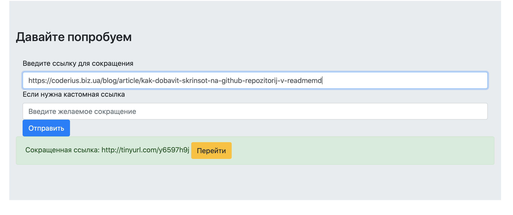
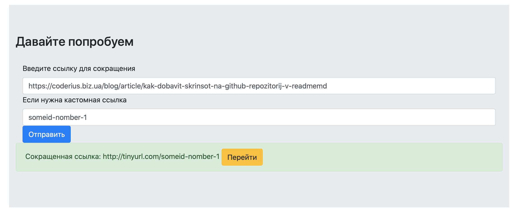

## Shortening links

A project to create a short link.

Technologies used

- Django 3.1.1
- Docker 19.03.12
- pyshorteners - Python library
- TinyURL API - API TinyURL.com
- Python 3.8

## Install

> The project uses **Docker** containerization, you will need 
	to have Docker on your machine.  see https://docs.docker.com/get-started/. 

```1. git clone https://github.com/Mejay013/avito_test.git ```

```2. cd avito_test```

```2. docker-compose build```

```2. docker-compose up```

## Use
If you want a simple shortened link:

1. Go to  ```localhost:8000```
2. Paste the link in the **required field**
3. Submit and and copy the short link

​

If you want a castom shortened link:

1. Go to  ```localhost:8000```
2. Paste the link in the **required field**
3. Paste the custom string in the **required field**
4. Submit and and copy the short link

​